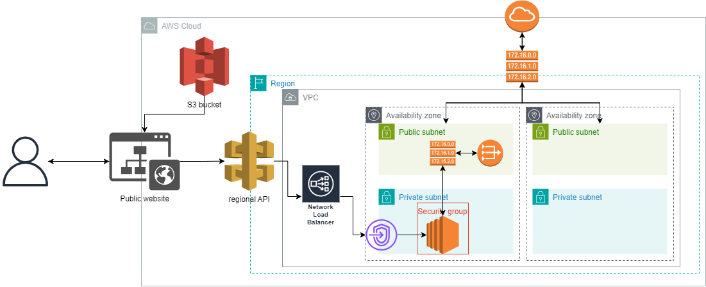

# Waf Provider

## Use Cases

**Scenario 1:**
A company has a hybrid cloud architecture that combines an on-premises data center with public cloud services (e.g., EC2). The company uses Nginx as a reverse proxy and load balancer, but due to the outdated hardware in their on-premises data center, which cannot support the latest operating system versions (or lacks sufficient resources for upgrades), they are unable to easily upgrade to the latest version of Nginx. This creates potential security vulnerabilities.

**Scenario 2:**
AWS offers numerous rule groups for purchase and application, covering a wide range of network attacks and aimed at addressing common threats. While these seem effective and convenient, the product documentation and features of these "all-in-one solutions" are very vague. Consumers cannot clearly understand the specific functions and performance of the equipment, making it difficult to fully grasp the product's effectiveness and security before purchase, thus increasing the risk of making a wrong choice. Moreover, a one-size-fits-all defense approach may not precisely meet the customer's specific needs, leading to wasted resources.

**Scenario 3:**
A company detects a sudden and specific attack through its system monitoring tools and log analysis. Since the existing defense equipment cannot quickly scale or adjust its configuration to handle such attack traffic, a temporary firewall is needed to quickly restore services and protect the system.

**Scenario 4:**
If a company lacks security experts with adequate cloud security experience, there is a risk of improper configuration when setting up firewalls. For example, overly permissive security rules might allow unnecessary traffic into the system, or the firewall might fail to effectively block known attack sources. These issues can expose the company's cloud environment to potential security threats.

To address this, our service provides different solutions to meet various customer needs. For example, for small businesses or users who are not very familiar with security, we offer a range of pre-configured security policy templates suitable for common use cases and attack scenarios. Users only need to select the appropriate template, and the system will automatically configure the firewall rules.

**Scenario 5:**
For enterprises unfamiliar with cloud environments, our service offers a straightforward interactive interface and uses APIs as the interface for firewall setup. Customers only need to focus on how to call the API and handle the results, without worrying about complex implementation details. This allows even non-technical personnel to use and integrate these features, providing enhanced protection for their cloud environment.

## Architecture

