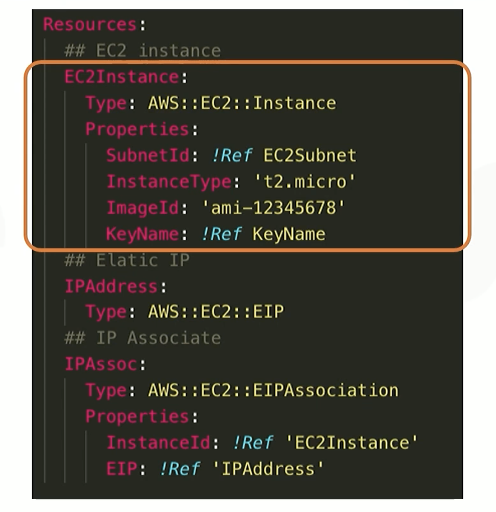

# cloudformation
- template
  - JSON/YAML
- copy templates automatically
- how to write
  - Description
    - the propose of the architecture made by template
  - Metadata
    - provide additional details about resources in template
      - e.g. region, ec2's instance type, ...
  - Resources
    - set properties
    - 
- parallelism
  - reference
    - use `!ref <BLOCK_NAME>` to let resources reference other blocks in template
    - we do not need to write in order
  - dependsOn
    - depends on a resource
    - attach
  - DeletionPolicy
    - preserve or back up a resource 
    - options
      - delete
      - retain
      - snapshot
- custom resource
  - third-party, ...
- warning
  - templates might be wrong in others environment if the parameters are defined strictly, e.g. SubnetID, region, ...
    - solve
      - customize parameter in Parameter, then reference these in resource blocks
- quality input
  - AllowPattern
    - apecify regular expression that constrains input values
  - AllowValues
    - specify a set of options, e.g. give options of EC2 instance type to provide choices but restrict types
  - Default
- mapping
  -  use `Fn::FindInMap`
  -  key-val
-  Conditions
-  edit
   -  /
-  design concept
-  official sample
   -  Official Sample Tamplate
   -  Official AWS Quick Starts
-  

# High Availability