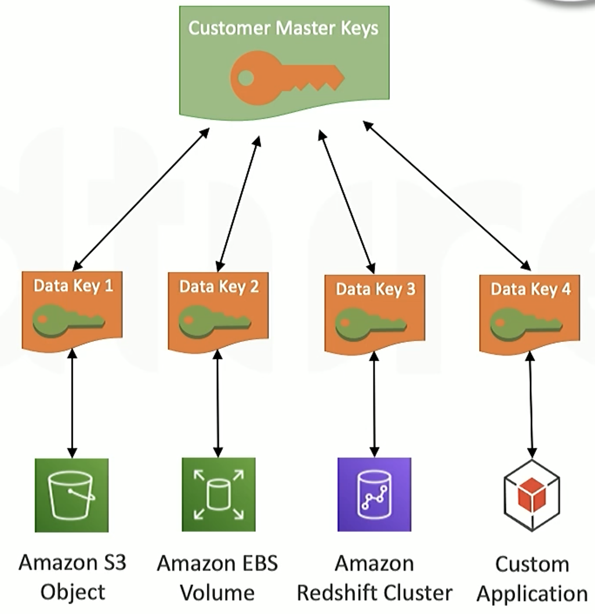
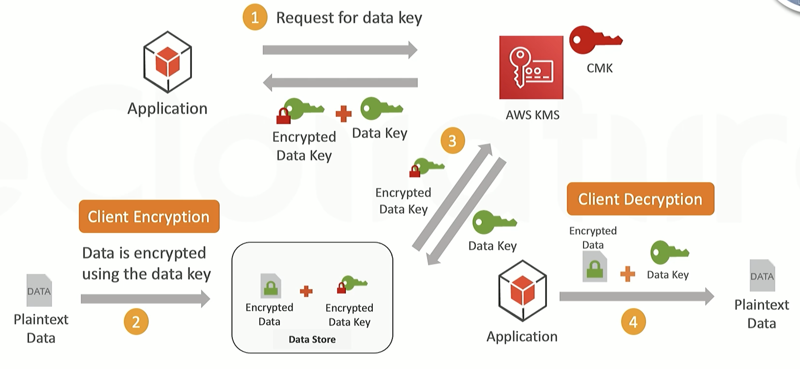

# AWS WAF
- protect web applications or API
- firewall to block flows
- use with 
  - CloudFront
  - API Gateway
  - Application Load Balancer
- defense strategy
  - manage rule(build-in)
  - SQL-injection
  - cross-site scripting
  - Text transformation
  - IP
  - Geofencing
  - ...

# AWS shield
- defense 
  - DOS
  - DDOS
- functions
  - always-on monitoring
  - notification and reporting when attack occurs
- use with
  - route 53
  - cloudfront
  - ELB
- type
  - standard shield
  - advanced shield

# KMS Key Management Service
- to manage master keys
- 
> - the key to encrypt data called data key
> - the key to encrypt key called master key
- 
  - After requesting for data key, we use the data key to encrypt data and then delete this data key. Only remain the encrypted data key.
  - when we need to decrypt the key, just send the encrypted data key to KMS
- get unique data key when requesting anytime
- use with directly
  - S3
  - EBS
  - ...