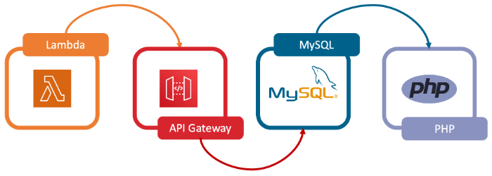

# 1. Hosting a Static Website on Amazon S3

## learn
- Create a static website hosting through S3
- How to use Amazon S3

# 2. Connect to EC2 Linux Instance
EC2 Instance can be different types of servers such as a web server, database server, authentication server... For using EC2 as a server, sometimes user might upload packages and software required to it before development. Therefore, user will access EC2 through different ways, SSH connection is mostly used among these ways. 

In this practice, I learned access EC2 through SSH with EC2-key-pair and commands.

More information about EC2 connection could be found in [連線至 EC2 的三種方法與比較 – SSH、EC2 Instance Connect、System Manager](https://www.ecloudture.com/連線至ec2的三種方法與比較-ssh，ec2實例連接，系統管理/) written by ECV.


```
chmod 400 <yourKeyPair.pem>
```
Due to the setting of Linux2 or Amazon Linux AMI, the user name is ec2-user.
```
ssh -i <yourKeyPair.pem> ec2-user@<EC2_INSTANCE_IP>
```
## learn
- Launch an EC2 instance
- Create a key pair
- Connect your EC2 Instance by using terminal or putty.exe


# 3. Implement an LAMP structure
> LAMP is known for its free and open-source approach to back end development. It contains Linux OS, Apache web server, MySQL database, and PHP. Besides PHP, developers can also use Python and Perl as an alternative.

The article above is a short description about LAMP structure from learning materials. Users use LAMP for building a web page due to its inexpensive cost, efficiency, high maintenance and support, flexibility. After first practice, we learned how to build a static, simple website with Amazon S3, and now we can build both static and dynamic website with LAMP structure.



More information could be found in [What is a LAMP stack?](https://aws.amazon.com/what-is/lamp-stack/?nc1=h_ls) written by AWS team.

In this practice, I use EC2 instance as a web server to connect RDS database. With the public IP assigned by EC2 automatically, we can do CRUD operations through the web page below.


## learn 
- Deploy a RDS database and web server
- Connect your web server to your database


# 4. Create Your EC2 Instance in Your Custom Network Environment


In this workshop, we let the EC2 instance, which called ForTestNAT in the private subnet, could connect to the Internet by setting route table and session manager. 

After attaching Internet gateway and NAT gateway, the EC2 can get the resources outside or ping to the websites.


We can also browse this website through its public IP.


others: [Why does a AWS NAT Gateway require an ElasticIP?](https://stackoverflow.com/questions/43094786/why-does-a-aws-nat-gateway-require-an-elasticip)

## learn
- Configure VPC and Subnet to your own internet environment
- Edit your Route Table to the accurate path
- Knowing the difference between network in and out and how we could use NAT Gateway to route our private network to public

# 5. How to Setup Site-to-Site VPN Connection

## learn
- How to setup Site-to-Site VPN Connection
- Build a connection tunnel between two different VPC


# 6. Using CloudWatch and SNS Services to Monitor Your Website
In this lab, we learn how to create a alarm for checking the status of EC2 instance's CPU usage. When the usage is over a value, the alarm will notify us through the email.


## learn 
- How to design your threshold metrics with CloudWatch.
- Create an Amazon Linux Instance from an Amazon Machine Image (AMI).
- Monitor service states and send SNS when alarm.

# 7. CloudWatch Alarms for CloudTrail Events
In this lab, we create a alarm for checking the status of the S3 bucket. When adding a new content to S3 bucket, the alarm will notify us through the email.


## learn
- How to Trail to record the Event.
- How to Create Alarm CloudWatch.
- How to Send Nofication by SNS.


# 8. Build an Elastic and Low Latency Architecture on the Cloud

## learn 


# 10. Get Started with AWS WAF
AWS WAF is a firewall to protect our web application. The method of protecting by firewall is to block IPs in the black list. In this practice, we need to create a black list for our web and test how it works. The architecture like below.


We created a Web ACL for our testing web like below. We also created a black list, which includes my IP, as a rule for ACL. After I attach the WAF rules to the CloudFront distribution for the website. I cannot browse the web through the browser in my computer.


However, if I remove the rule, I can browse that website again.


> If the website url we use is generated by S3 buckets, we can manage it to be public or not through the setting in S3 instead of WAF. 

## learn 
- How to create WAF web ACL and rule to protect your web.
- How to attach WAF to CloudFront Distribution.
- How to edit the WAF rule to limit the request from client.